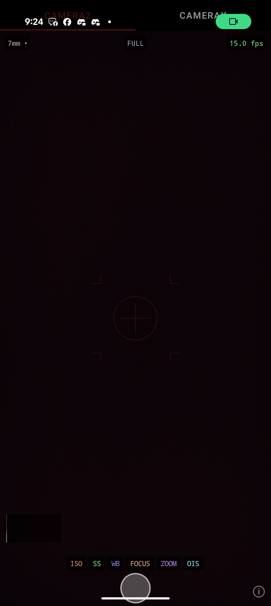

# An tool for investigating Android phone cameras



Generated by Claude using the superpowers skills starting
from this prompt:
```
I want to build a test Android app to help me understand the capabilities of the Android camera. Ultimately, I will use this knowledge to build a 'live view' into Sky Map where users can see the map overlaid over a view through the camera. We will 
   possibly also use the images to do autocalibration, if the light sources (moon, bright stars) are detectible.  To do this I need to experiment with the camera capabilities and that's where this app comes in.  It should use the camera APIs that    
  will be available to me in Sky Map.  It should have onscreen controls where I can experiment with the various exposure and quality controls that the API makes available. It should show a simple overlay over the camera view - a targetting recticle  
  like you might have in a first person shooter game will do.  It should also display any settings that the camera API exposes (e.g. aperture, ISO, frames per second, shutter speed - whatever you can find).  The app needs to be functional rather     
  than pretty. Call out any areas where different phones might have different capabilities.  Remember that this is mostly for testing at night looking at the sky.          
```

# Update 1.
Claude messed up the gradle set up, missing the crucial 
`android.useAndroidX=true` in the `gradle.properties` file.  Even with that the code does
not build.
OK, after getting Claude to fix gradle it looks like it now builds.

# Costs to get this far

| Metric | Value |
| :--- | :--- |
| **Total cost** | $13.93 |
| **Total duration (API)** | 1h 4m 36s |
| **Total duration (wall)** | 2d 0h 53m |
| **Total code changes** | 5440 lines added, 97 lines removed |

### Usage by model

| Model | Input | Output | Cache Read | Cache Write | Cost |
| :--- | :--- | :--- | :--- | :--- | :--- |
| `claude-haiku-4-5` | 681 | 17 | 0 | 0 | $0.0008 |
| `claude-sonnet-4-6` | 7.3k | 260.7k | 20.3m | 1.0m | $13.93 |
